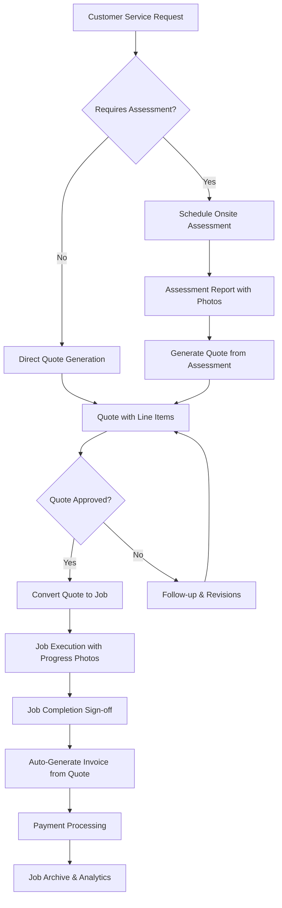

# 🎯 CRM Project Evaluation & Development Roadmap

## 📊 **Current State Assessment**

### ✅ **Foundation Complete (100%)**
- **✅ Modern Tech Stack**: React 19 + TypeScript + Vite + Tailwind CSS
- **✅ Database Schema**: Comprehensive, secure schema with RLS policies
- **✅ Authentication System**: Supabase Auth with proper error handling
- **✅ Security Infrastructure**: Backup scripts, Git workflows, pre-commit hooks
- **✅ Type Safety**: Complete TypeScript definitions for all database ---

## 🗄️ **Database Schema Additions for Request Management**

### **New Tables Required**
```sql
-- Service Requests Table
CREATE TABLE requests (
  id uuid PRIMARY KEY DEFAULT gen_random_uuid(),
  customer_id uuid REFERENCES customers(id) ON DELETE CASCADE,
  user_id uuid REFERENCES auth.users(id) ON DELETE CASCADE,
  title text NOT NULL,
  description text,
  priority text DEFAULT 'medium' CHECK (priority IN ('low', 'medium', 'high', 'urgent')),
  status text DEFAULT 'received' CHECK (status IN ('received', 'assessed', 'quoted', 'approved', 'converted')),
  requires_assessment boolean DEFAULT false,
  location_notes text,
  preferred_contact_method text,
  created_at timestamptz DEFAULT now(),
  updated_at timestamptz DEFAULT now()
);

-- Onsite Assessments Table
CREATE TABLE assessments (
  id uuid PRIMARY KEY DEFAULT gen_random_uuid(),
  request_id uuid REFERENCES requests(id) ON DELETE CASCADE,
  user_id uuid REFERENCES auth.users(id) ON DELETE CASCADE,
  scheduled_date timestamptz,
  completed_date timestamptz,
  findings text,
  recommendations text,
  estimated_duration_hours numeric(5,2),
  estimated_cost numeric(10,2),
  status text DEFAULT 'scheduled' CHECK (status IN ('scheduled', 'completed', 'cancelled')),
  created_at timestamptz DEFAULT now(),
  updated_at timestamptz DEFAULT now()
);

-- Request Files/Photos Table
CREATE TABLE request_files (
  id uuid PRIMARY KEY DEFAULT gen_random_uuid(),
  request_id uuid REFERENCES requests(id) ON DELETE CASCADE,
  assessment_id uuid REFERENCES assessments(id) ON DELETE CASCADE,
  user_id uuid REFERENCES auth.users(id) ON DELETE CASCADE,
  file_name text NOT NULL,
  file_path text NOT NULL,
  file_type text NOT NULL,
  file_size integer,
  description text,
  category text DEFAULT 'reference' CHECK (category IN ('reference', 'assessment', 'before', 'after', 'damage')),
  created_at timestamptz DEFAULT now()
);

-- Workflow Tracking Table
CREATE TABLE workflow_conversions (
  id uuid PRIMARY KEY DEFAULT gen_random_uuid(),
  source_type text NOT NULL CHECK (source_type IN ('request', 'quote', 'job')),
  source_id uuid NOT NULL,
  target_type text NOT NULL CHECK (target_type IN ('quote', 'job', 'invoice')),
  target_id uuid NOT NULL,
  user_id uuid REFERENCES auth.users(id) ON DELETE CASCADE,
  conversion_notes text,
  created_at timestamptz DEFAULT now()
);
```

### **Schema Updates to Existing Tables**
```sql
-- Add request reference to quotes table
ALTER TABLE quotes ADD COLUMN request_id uuid REFERENCES requests(id) ON DELETE SET NULL;
ALTER TABLE quotes ADD COLUMN assessment_id uuid REFERENCES assessments(id) ON DELETE SET NULL;

-- Add quote reference to jobs table (already exists)
ALTER TABLE jobs ADD COLUMN quote_id uuid REFERENCES quotes(id) ON DELETE SET NULL;

-- Add request reference to jobs table for direct conversions
ALTER TABLE jobs ADD COLUMN request_id uuid REFERENCES requests(id) ON DELETE SET NULL;
```

---

### **📋 Ready-to-Start Checklist**

### **Immediate Next Steps (This Week)**ities
- **✅ Environment Setup**: Proper configuration management with .env

### 🎉 **Phase 1 Complete (100%)**
- **✅ Dashboard & Navigation**: Professional responsive dashboard with full routing
- **✅ Layout System**: Sidebar, header, and layout components with mobile support
- **✅ Authentication Integration**: Protected routes with seamless auth flow
- **✅ Modern UI/UX**: Clean design with stats cards, quick actions, and activity feed
- **✅ Route Management**: Complete router setup with protected route guards

### ⚡ **Partially Implemented (75%)**
- **✅ Modern Dashboard**: Complete responsive dashboard with stats, navigation, and routing
- **✅ Authentication Flow**: Enhanced auth with proper routing integration
- **✅ Layout System**: Professional sidebar, header, and layout components
- **🟡 Database Integration**: Types defined, hooks need implementation for data fetching
- **🟡 Stripe Integration**: Configuration ready, needs implementation

### 🎉 **Phase 2 Complete (100%)**
- **✅ Customer Management**: Complete CRUD operations with professional UI
- **✅ Customer List View**: Grid/table views with search, filter, and sorting
- **✅ Customer Detail View**: Comprehensive customer information display
- **✅ Customer Edit System**: Form-based editing with validation
- **✅ Navigation Flow**: Seamless customer workflow with React Router
- **✅ Real-time Data**: Live updates with Supabase subscriptions

### ❌ **Missing Core Features (0%)**
- **❌ Job Management**: No job tracking system
- **❌ Quote/Invoice System**: No business workflow
- **❌ Calendar/Scheduling**: No appointment system
- **❌ Payment Processing**: No Stripe integration
- **❌ File Management**: No document/photo uploads
- **❌ Reporting**: No analytics or insights

---

## 🚀 **Recommended Development Roadmap**

### **Phase 1: Core UI Foundation (Week 1-2)**

#### **Priority 1.1: Main Dashboard & Navigation**
```bash
# Create core dashboard infrastructure
src/components/layout/
├── Dashboard.tsx          # Main dashboard with stats overview
├── Sidebar.tsx           # Navigation sidebar
├── Header.tsx            # Top navigation with search
└── Layout.tsx            # Main layout wrapper

src/pages/
├── DashboardPage.tsx     # Dashboard page component
└── index.ts              # Page exports
```

**Tasks:**
- [x] Create responsive dashboard layout
- [x] Implement sidebar navigation with routing
- [x] Add header with search functionality
- [x] Create dashboard stat cards (customers, jobs, revenue)
- [x] Add recent activity feed
- [x] Implement dark/light mode toggle

#### **Priority 1.2: Basic Routing System**
```bash
# Add React Router for navigation
npm install react-router-dom @types/react-router-dom

src/router/
├── AppRouter.tsx         # Main router configuration
├── ProtectedRoute.tsx    # Auth-protected routes
└── routes.ts             # Route definitions
```

**Tasks:**
- [x] Set up React Router with protected routes
- [x] Create route guards for authentication
- [x] Implement breadcrumb navigation
- [x] Add page transitions and loading states

### **Phase 2: Customer Management (Week 2-3) ✅ COMPLETE**

#### **Priority 2.1: Customer CRUD Operations ✅ COMPLETE**
```bash
src/components/customers/
├── CustomerList.tsx      # ✅ Customer listing with search/filter
├── CustomerForm.tsx      # ✅ Create/edit customer form  
├── CustomerDetail.tsx    # ✅ Detailed customer view
├── CustomerEdit.tsx      # ✅ Edit wrapper component
└── (CustomerCard.tsx)    # ✅ Integrated in CustomerList

src/hooks/
├── useCustomers.ts       # ✅ Customer data management
└── (useCustomerForm.ts)  # ✅ Integrated in CustomerForm
```

**Tasks:**
- [x] Create customer listing page with grid/table views
- [x] Implement customer creation form with validation
- [x] Add customer editing functionality with pre-population
- [x] Create detailed customer view with contact info and stats
- [x] Add search and filtering capabilities
- [x] Implement real-time data synchronization
- [x] Add professional navigation flow between views

#### **Priority 2.2: Customer Data Enhancement**
**Tasks:**
- [ ] Add customer photo uploads
- [ ] Implement customer notes and tags
- [ ] Create customer communication history
- [ ] Add customer preferences tracking
- [x] **Implement customer import/export functionality** ✅ COMPLETE
  - ✅ CSV import UI with multi-step workflow (upload → mapping → preview → processing → results)
  - ✅ Robust Edge function for bulk CSV processing with proper error handling
  - ✅ Field mapping with auto-detection of common CSV formats
  - ✅ Validation system with detailed error reporting
  - ✅ Professional user interface with progress indicators

### **Phase 3: Request Management System (Week 3-4)**

#### **Priority 3.1: Service Request Workflow**
```bash
src/components/requests/
├── RequestList.tsx       # Service request listing with status filters
├── RequestForm.tsx       # New request creation form
├── RequestDetail.tsx     # Detailed request view with photos
├── RequestEdit.tsx       # Request editing and updates
├── OnlineRequestForm.tsx # Customer-facing online request form
├── PhotoGallery.tsx      # Photo management for requests
├── AssessmentScheduler.tsx # Onsite assessment scheduling
└── RequestActions.tsx    # Convert to quote/job actions

src/components/assessments/
├── AssessmentForm.tsx    # Onsite assessment form
├── AssessmentReport.tsx  # Assessment report generation
└── AssessmentSchedule.tsx # Assessment calendar integration

src/hooks/
├── useRequests.ts        # Request data management
├── useRequestPhotos.ts   # Photo upload and management
├── useAssessments.ts     # Assessment scheduling and tracking
└── useRequestWorkflow.ts # Request → Quote → Job conversion
```

**Tasks:**
- [ ] Create service request intake system
- [ ] Implement photo upload with drag-drop interface
- [ ] Add onsite assessment scheduling workflow
- [ ] Create customer-facing online request form
- [ ] Implement request-to-quote conversion system
- [ ] Add assessment report generation
- [ ] Create request status tracking (received → assessed → quoted)
- [ ] Implement automated follow-up notifications

#### **Priority 3.2: Photo & File Management**
```bash
src/components/files/
├── FileUpload.tsx        # Multi-file upload with progress
├── PhotoViewer.tsx       # Photo gallery with zoom/annotation
├── FileManager.tsx       # File organization and tagging
└── MobilePhotoCapture.tsx # Mobile camera integration

src/hooks/
├── useFileUpload.ts      # File upload with Supabase Storage
├── usePhotoManagement.ts # Photo organization and metadata
└── useFileSharing.ts     # Secure file sharing with customers
```

**Tasks:**
- [ ] Implement Supabase Storage integration for photos
- [ ] Create photo annotation and markup tools
- [ ] Add before/after photo comparison views
- [ ] Implement file categorization and tagging
- [ ] Create secure customer file sharing portal
- [ ] Add mobile camera integration for field photos

### **Phase 4: Job Management System (Week 4-5)**

#### **Priority 4.1: Job Workflow & Conversion**
```bash
src/components/jobs/
├── JobList.tsx           # Job listing with status filters
├── JobCard.tsx           # Job summary card
├── JobForm.tsx           # Create/edit job form (from request/quote)
├── JobView.tsx           # Detailed job view with request history
├── JobTimeline.tsx       # Job progress timeline
├── JobStatusBoard.tsx    # Kanban-style job board
└── RequestToJobConverter.tsx # Convert approved quotes to jobs

src/hooks/
├── useJobs.ts            # Job data management
├── useJobWorkflow.ts     # Job status transitions
├── useJobScheduling.ts   # Scheduling logic
└── useJobConversion.ts   # Quote → Job conversion logic
```

**Tasks:**
- [ ] Create job listing with status-based filtering
- [ ] Implement job creation from approved quotes
- [ ] Add job scheduling with calendar integration
- [ ] Create job progress tracking system
- [ ] Link job photos from original request
- [ ] Implement job notes and updates
- [ ] Add time tracking for jobs
- [ ] Create job completion workflow with customer sign-off

### **Phase 5: Quote & Invoice System (Week 5-6)**

#### **Priority 5.1: Quote Management & Conversion**
```bash
src/components/quotes/
├── QuoteList.tsx         # Quote listing and management
├── QuoteForm.tsx         # Quote creation from requests/assessments
├── QuoteBuilder.tsx      # Interactive quote builder with request data
├── QuotePreview.tsx      # Quote preview and PDF export
├── QuoteTemplates.tsx    # Quote templates management
├── RequestToQuoteConverter.tsx # Convert requests to quotes
└── QuoteApprovalWorkflow.tsx   # Customer quote approval process

src/hooks/
├── useQuotes.ts          # Quote data management
├── useQuoteBuilder.ts    # Quote line item management
├── useQuoteConversion.ts # Request → Quote conversion logic
└── usePDFGeneration.ts   # PDF generation logic
```

**Tasks:**
- [ ] Create quote builder with line items and request context
- [ ] Implement request-to-quote conversion with photo inclusion
- [ ] Add quote templates with service categories
- [ ] Create quote PDF generation with before photos
- [ ] Implement customer quote approval workflow
- [ ] Add quote versioning and revision tracking
- [ ] Create quote-to-job conversion system
- [ ] Implement automated quote follow-up system

#### **Priority 5.2: Invoice Management & Automation**
```bash
src/components/invoices/
├── InvoiceList.tsx       # Invoice listing and tracking
├── InvoiceForm.tsx       # Invoice creation from approved quotes
├── InvoiceView.tsx       # Invoice display with job completion photos
├── PaymentTracking.tsx   # Payment status tracking
├── QuoteToInvoiceConverter.tsx # Convert approved quotes to invoices
└── InvoiceAutomation.tsx # Automated invoice generation

src/hooks/
├── useInvoices.ts        # Invoice data management
├── useInvoiceGeneration.ts # Quote → Invoice conversion
└── usePaymentTracking.ts # Payment status management
```

**Tasks:**
- [ ] Create invoice generation from approved quotes
- [ ] Implement automatic invoice creation on job completion
- [ ] Add invoice PDF generation with before/after photos
- [ ] Create payment status tracking and reminders
- [ ] Implement invoice payment recording
- [ ] Add customer payment portal integration
- [ ] Create recurring invoice automation
- [ ] Implement late payment notification system

### **Phase 6: Stripe Payment Integration (Week 6-7)**

#### **Priority 6.1: Payment Processing**
```bash
src/components/payments/
├── PaymentForm.tsx       # Stripe payment form
├── PaymentHistory.tsx    # Payment transaction history
├── PaymentLinks.tsx      # Payment link generation
└── RefundManager.tsx     # Refund management

src/hooks/
├── useStripe.ts          # Stripe integration
├── usePayments.ts        # Payment processing
└── useSubscriptions.ts   # Subscription management

src/lib/
├── stripe.ts             # Stripe client configuration
└── payment-utils.ts      # Payment utility functions
```

**Tasks:**
- [ ] Integrate Stripe payment forms
- [ ] Create customer payment portals
- [ ] Implement subscription billing
- [ ] Add payment link generation
- [ ] Create payment tracking dashboard
- [ ] Implement refund processing

### **Phase 7: Advanced Features (Week 7-9)**

#### **Priority 7.1: Calendar & Scheduling**
```bash
src/components/calendar/
├── Calendar.tsx          # Main calendar component
├── EventForm.tsx         # Event creation/editing
├── ScheduleView.tsx      # Weekly/daily schedule view
└── AppointmentBooking.tsx # Customer booking portal

src/hooks/
├── useCalendar.ts        # Calendar data management
├── useScheduling.ts      # Scheduling logic
└── useAvailability.ts    # Availability management
```

**Tasks:**
- [ ] Create interactive calendar component
- [ ] Implement job scheduling system
- [ ] Add appointment booking for customers
- [ ] Create schedule optimization
- [ ] Add calendar synchronization (Google Calendar)
- [ ] Implement scheduling notifications

#### **Priority 7.2: Advanced File Management**
```bash
src/components/files/
├── FileUpload.tsx        # File upload component
├── FileGallery.tsx       # Image/document gallery
├── DocumentManager.tsx   # Document organization
└── PhotoCapture.tsx      # Photo capture for mobile

src/hooks/
├── useFileUpload.ts      # File upload management
└── useDocuments.ts       # Document management
```

**Tasks:**
- [ ] Implement file upload system
- [ ] Create photo galleries for jobs
- [ ] Add document management
- [ ] Create mobile photo capture
- [ ] Implement file sharing with customers

### **Phase 8: Reporting & Analytics (Week 8-10)**

#### **Priority 8.1: Business Intelligence**
```bash
src/components/reports/
├── RevenueReports.tsx    # Revenue analytics
├── JobReports.tsx        # Job performance metrics
├── CustomerReports.tsx   # Customer analytics
└── ExportManager.tsx     # Data export functionality

src/hooks/
├── useAnalytics.ts       # Analytics data
├── useReporting.ts       # Report generation
└── useExports.ts         # Data export logic
```

**Tasks:**
- [ ] Create revenue tracking and forecasting
- [ ] Implement job performance analytics
- [ ] Add customer lifetime value tracking
- [ ] Create custom report builder
- [ ] Add data export functionality
- [ ] Implement automated reporting

---

## 🎯 **Implementation Priority Matrix**

### **🔥 Critical (Week 1-2)**
1. **Dashboard & Navigation** - Core user experience
2. **Customer Management** - Primary business entity
3. **Basic Authentication Flow** - User onboarding

### **⚡ High Priority (Week 3-4)**
1. **Request Management** - Customer intake and assessment workflow
2. **Photo & File Upload** - Documentation and evidence collection
3. **Onsite Assessment Scheduling** - Professional service delivery

### **📈 Medium Priority (Week 4-5)**
1. **Job Management** - Core business workflow with conversion from quotes
2. **Workflow Automation** - Request → Quote → Job → Invoice pipeline
3. **Customer Communication** - Status updates and notifications

### **� Revenue Critical (Week 5-6)**
1. **Quote System** - Revenue generation with request integration
2. **Invoice Automation** - Streamlined billing from approved quotes
3. **Payment Processing** - Revenue collection and tracking

### **🎯 Business Enhancement (Week 6-8)**
1. **Stripe Integration** - Professional payment processing
2. **Calendar Integration** - Scheduling optimization
3. **Advanced File Management** - Document organization

### **🌟 Analytics & Growth (Week 8-10)**
1. **Advanced Analytics** - Business intelligence and reporting
2. **Mobile Optimization** - Field use and customer portals
3. **API Integration** - Third-party tools and automation

---

## � **Complete Business Workflow Integration**

### **🚀 End-to-End Customer Journey**


### **🔗 System Integration Points**
1. **Request → Assessment**: Automatic scheduling with photo requirements
2. **Assessment → Quote**: Pre-populated quote from assessment findings
3. **Quote → Job**: Seamless conversion with all context preserved
4. **Job → Invoice**: Automated invoice generation with completion photos
5. **Cross-System Data Flow**: Real-time updates across all modules

### **📸 Photo & Documentation Workflow**
- **Request Stage**: Customer uploads reference photos
- **Assessment Stage**: Technician captures detailed assessment photos
- **Quote Stage**: Photos included in quote for transparency
- **Job Stage**: Progress photos and before/after documentation
- **Invoice Stage**: Completion photos attached for verification

---

## �🛠️ **Technical Implementation Strategy**

### **Development Approach**
1. **Component-First**: Build reusable UI components
2. **Hook-Driven**: Use custom hooks for business logic
3. **Type-Safe**: Maintain strict TypeScript usage
4. **Test-Driven**: Add tests for critical functionality
5. **Progressive Enhancement**: Start simple, add complexity

### **Code Organization**
```bash
src/
├── components/           # Organized by feature
│   ├── customers/        # Customer management (✅ Complete)
│   ├── requests/         # Service request intake and management
│   ├── assessments/      # Onsite assessment scheduling and reports
│   ├── jobs/            # Job management and execution
│   ├── quotes/          # Quote generation and approval
│   ├── invoices/        # Invoice generation and payment tracking
│   ├── files/           # File upload and photo management
│   ├── calendar/        # Scheduling and appointment management
│   ├── reports/         # Analytics and business intelligence
│   ├── payments/        # Stripe integration and payment processing
│   ├── workflow/        # Cross-system conversion components
│   ├── layout/          # Dashboard and navigation (✅ Complete)
│   └── ui/              # Reusable UI components
├── hooks/               # Custom business logic hooks
│   ├── useCustomers.ts  # ✅ Complete
│   ├── useRequests.ts   # Service request management
│   ├── useJobs.ts       # Job workflow management  
│   ├── useQuotes.ts     # Quote generation and tracking
│   ├── useInvoices.ts   # Invoice automation
│   ├── useFiles.ts      # File upload and management
│   ├── useWorkflow.ts   # Cross-system conversions
│   └── usePayments.ts   # Payment processing
├── pages/               # Page-level components
├── lib/                 # Utilities and configurations
├── types/               # TypeScript definitions
└── utils/               # Helper functions
```

### **Quality Assurance**
- [ ] Set up automated testing (Jest + React Testing Library)
- [ ] Implement component storybook for UI development
- [ ] Add end-to-end testing with Playwright
- [ ] Create code review guidelines
- [ ] Set up automated deployment pipeline

---

## 📋 **Ready-to-Start Checklist**

### **Immediate Next Steps (This Week)**
- [x] Apply database migration: `./scripts/migrate-db.sh development`
- [x] Set up React Router for navigation
- [x] Create basic dashboard layout
- [x] Implement customer listing page
- [x] Add customer creation form
- [x] Create customer detail and edit views
- [x] **CSV Import System**: Professional bulk import functionality with Edge function
- [x] **Supabase Local Environment**: Successfully configured and running
- [x] **Phase 2 Complete**: Customer Management with comprehensive CRUD operations
- [ ] **NEXT: Database Schema Migration** - Add request management tables
- [ ] **NEXT: Start Phase 3 - Request Management System** - Customer intake workflow
- [ ] **PRIORITY: Photo Upload Integration** - Supabase Storage setup for request photos
- [ ] **PRIORITY: Assessment Scheduling** - Onsite visit workflow

### **Development Setup**
- [ ] Install additional dependencies (React Router, date libraries)
- [ ] Configure VS Code workspace settings
- [ ] Set up ESLint and Prettier rules
- [ ] Create component templates/snippets
- [ ] Set up testing environment

### **Team Preparation**
- [ ] Create development workflow documentation
- [ ] Set up project management (GitHub Issues/Projects)
- [ ] Define coding standards and conventions
- [ ] Plan sprint cycles and milestones
- [ ] Set up CI/CD pipeline

---

## 🎉 **Success Metrics**

### **Technical Metrics**
- **Code Quality**: 90%+ TypeScript coverage, ESLint clean
- **Performance**: <2s initial load, <500ms navigation
- **Security**: All RLS policies tested, no security warnings
- **Reliability**: 99%+ uptime, comprehensive error handling

### **Business Metrics**
- **User Adoption**: Easy onboarding, intuitive navigation
- **Feature Completeness**: All core CRM features functional
- **Scalability**: Handles 1000+ customers, 10000+ jobs
- **Mobile Ready**: Responsive design, touch-friendly interface

**Your CRM foundation is solid and ready for rapid development! 🚀**
